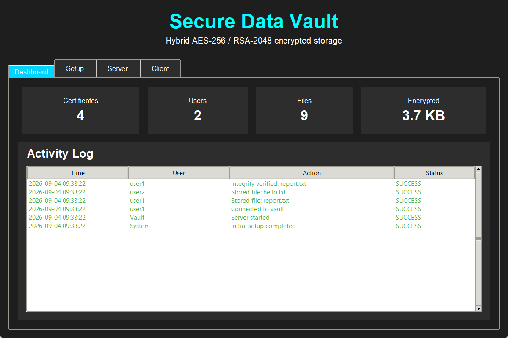
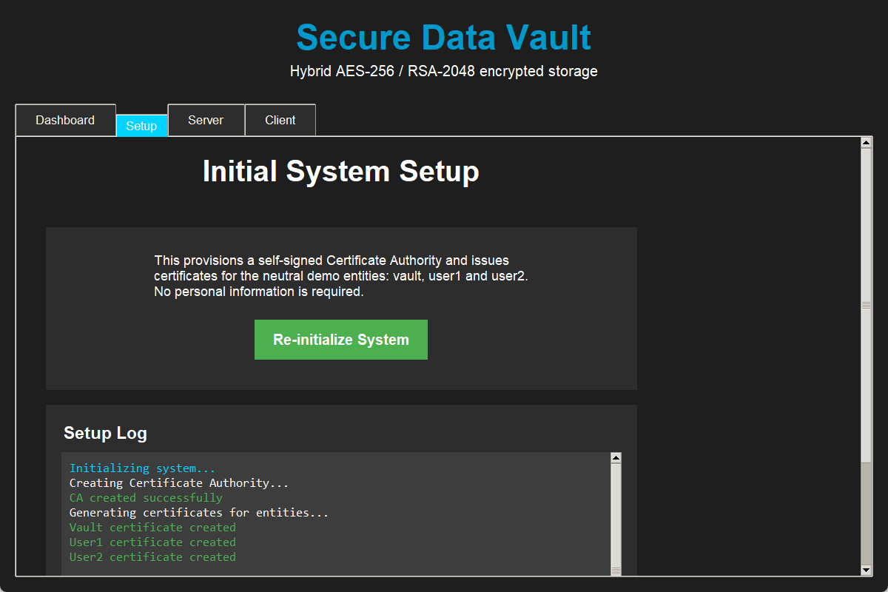
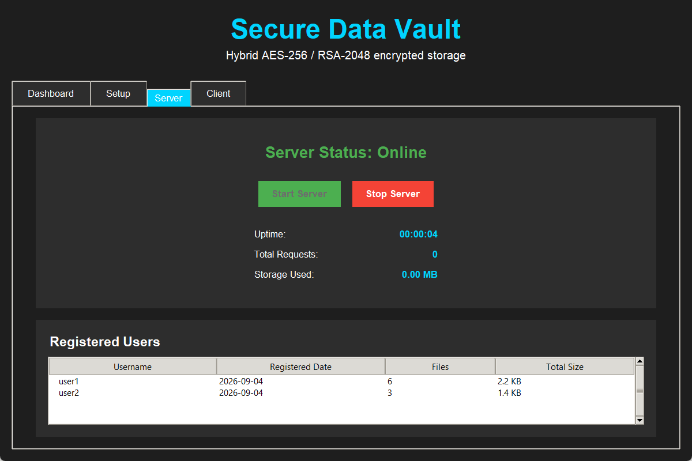
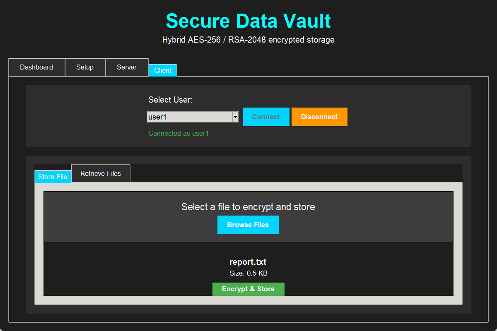
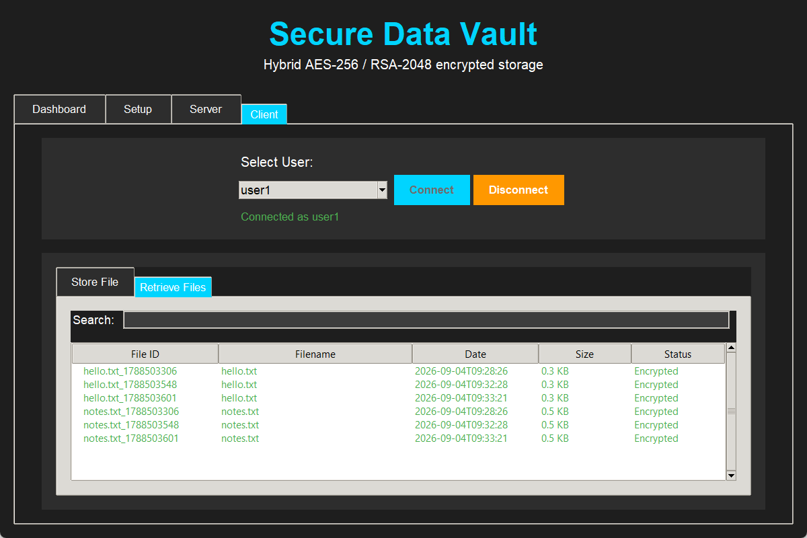

# Secure Data Vault

> A file vault that uses hybrid cryptography and its own X.509 PKI. Files are encrypted with AES-256, and each file's key is wrapped so that the vault itself can't read what it stores.

Secure Data Vault is a small self-contained system for storing files in
encrypted form. It mixes two kinds of cryptography: AES-256 does the fast bulk
encryption of the file contents, and RSA handles key wrapping and signatures,
all under a self-signed Certificate Authority. The trick is that each file's
AES key gets wrapped with the *uploading user's own* public key, so the vault
ends up holding data it has no way to decrypt. There's a command-line interface
and a desktop GUI, both sitting on top of the same core.

I originally wrote this for a university cryptography course and later cleaned
it up into a portfolio project. It's meant as a teaching demonstration, not
something you'd run in production. See [Threat model & limitations](#threat-model--limitations)
for the details.

## Features

- **Hybrid encryption.** AES-256-CBC encrypts the file contents; RSA-2048 with
  OAEP wraps each per-file AES key.
- **X.509 PKI with a built-in CA.** A self-signed RSA-4096 root issues RSA-2048
  certificates to the vault and to users.
- **Per-file tamper-evidence.** The vault signs the SHA-256 of every stored
  blob with RSA-PSS, and clients check that signature when they retrieve a file.
- **Zero-knowledge storage.** Because the AES key is wrapped with the user's own
  public key, the vault can't read the files it stores.
- **Two front-ends.** An interactive CLI and a dark-themed Tkinter GUI, both
  over the same core.
- **No committed secrets.** All keys and data are generated locally into a
  gitignored `data/` directory.

## Architecture

```
User  →  (encrypted file)  →  Vault  →  Encrypted storage
```

The CA issues certificates to the user and the vault. To store a file, the user
encrypts it and wraps the AES key with their *own* public key before handing it
over. So the vault only ever holds the ciphertext, the wrapped key (which it
can't unwrap), its own signature, and some metadata. It never sees the plaintext
or the AES key. There's a step-by-step walkthrough of the crypto and the data
flows in [docs/architecture.md](docs/architecture.md).

## Cryptographic design

| Purpose | Algorithm / parameters |
|---------|------------------------|
| File encryption | AES-256 in CBC mode, random 16-byte IV, PKCS#7 padding; stored as `IV \|\| ciphertext` |
| Key wrapping | RSA-2048, OAEP with MGF1 + SHA-256 |
| Signatures | RSA-PSS, MGF1 + SHA-256, salt length = MAX, over the hex SHA-256 of the ciphertext |
| Hashing / integrity | SHA-256 |
| Root CA | RSA-4096, self-signed, valid 3650 days |
| Leaf certificates | RSA-2048, CA-signed, valid 365 days |

## Quick start

Requires Python 3.9+.

```bash
# 1. Install the package and its dependencies (editable install)
pip install -e .

# 2. Generate a fresh demo (CA + vault + user1/user2 + sample files).
#    Everything is written under ./data (gitignored) — no secrets are committed.
python scripts/gen_demo.py

# 3a. Run the command-line interface
python -m secure_vault.cli        # or the installed entry point: secure-vault

# 3b. …or run the desktop GUI
python -m secure_vault.gui        # or: secure-vault-gui
```

If you'd rather not install anything, the package lives under `src/`, so you can
run the modules directly by putting `src/` on the import path:
`PYTHONPATH=src python -m secure_vault.cli`. `scripts/gen_demo.py` does that
itself, so step 2 works with just `pip install -r requirements.txt`.

You can point the base directory somewhere else with the `VAULT_HOME`
environment variable (it defaults to `./data`). The identity fields in the
certificates are neutral and can be set through `VAULT_ORG` and `VAULT_COUNTRY`.

If you want to see the same PKI set up by hand with the OpenSSL CLI, that's
written out in [`scripts/openssl_setup.sh`](scripts/openssl_setup.sh).

## Storage format

Every stored file turns into four artifacts under
`data/vault/storage/<user>/`, all sharing one `<file_id>`:

| File | Contents |
|------|----------|
| `<file_id>.enc` | `IV \|\| ciphertext` (AES-256-CBC) |
| `<file_id>.key` | The per-file AES key, RSA-OAEP-wrapped with the user's public key |
| `<file_id>.sig` | The vault's RSA-PSS signature over the SHA-256 of `.enc` |
| `<file_id>.meta` | JSON metadata: `original_filename`, `stored_at`, `file_hash`, `file_size` |

## Screenshots

Run the GUI after `gen_demo.py` to reproduce these. The image files live in
[`docs/screenshots/`](docs/screenshots/).

| | |
|---|---|
|  |  |
| **Dashboard** — certificate/user/file statistics and the activity log | **Setup** — one-click, neutral PKI provisioning |
|  |  |
| **Server** — vault online with its registered users | **Client** — picking a file and encrypting it |
|  | |
| **Client** — stored files listed as encrypted, ready to verify and decrypt | |

## Tests

```bash
pip install pytest
python -m pytest -q tests/
```

The tests cover the core primitives: the AES encrypt/decrypt round-trip, the
RSA-OAEP wrap/unwrap, and RSA-PSS sign/verify (including that tampering is
actually detected).

## Threat model & limitations

This is a teaching project, so I've tried to be clear about what it does and
doesn't do. It gives you confidentiality at rest, key confidentiality (only the
owner can decrypt), tamper-evidence the vault can verify, and PKI-based identity.
What it doesn't do: it stores private keys unencrypted on disk, it uses AES-CBC
rather than an authenticated cipher like GCM, there are no passwords, there's no
networking or TLS, and there's no certificate revocation. The full write-up is in
[docs/threat-model.md](docs/threat-model.md).

## Project structure

```
src/secure_vault/   Package: crypto_utils, ca, vault_server, client_app, cli, gui, config
scripts/            gen_demo.py (build a demo) and openssl_setup.sh (manual PKI)
docs/               Architecture, threat model, screenshots
examples/           Synthetic, non-personal sample files
tests/              pytest round-trip tests
```

## Project origin

This started life as a university cryptography course project. I've stripped out
all the personal identifiers from the original coursework, and the CA and demo
entities use neutral, non-personal identities.

## Author

**Panagiotis Stamatis** — [@panagiotistamatis](https://github.com/panagiotistamatis)

## License

Released under the [MIT License](LICENSE).
